# Officials Association Site

A public website and a members-only portal for a sports officials association, built on
Next.js 15, Supabase and Netlify Functions.

It assumes the shape of a real officials association: a roster of members with certification
levels and ranks, assignments and activity history, written evaluations, training events, a
document library, a newsletter, and an executive that has to publish news and rule
modifications without touching the code. The public site is what a league or a prospective
official sees. The portal behind the login is where the association runs itself.

This is a template, not a product. There is no hosted version, no support and no upgrade
path. You fork it, rebrand it, and it becomes your codebase.

**Read [Known gaps](#known-gaps) before you deploy this.** None of them will stop you standing
the site up. One of them breaks the portal's download links, and that is better to know now
than to hear from a member.

---

## Screenshots

These come from a local stack seeded with fictional demo data. The association, the people
and the documents in them do not exist. Regenerate the whole set with
`./scripts/screenshots/regenerate.sh` after a rebrand.

### Public site

| | |
|---|---|
| 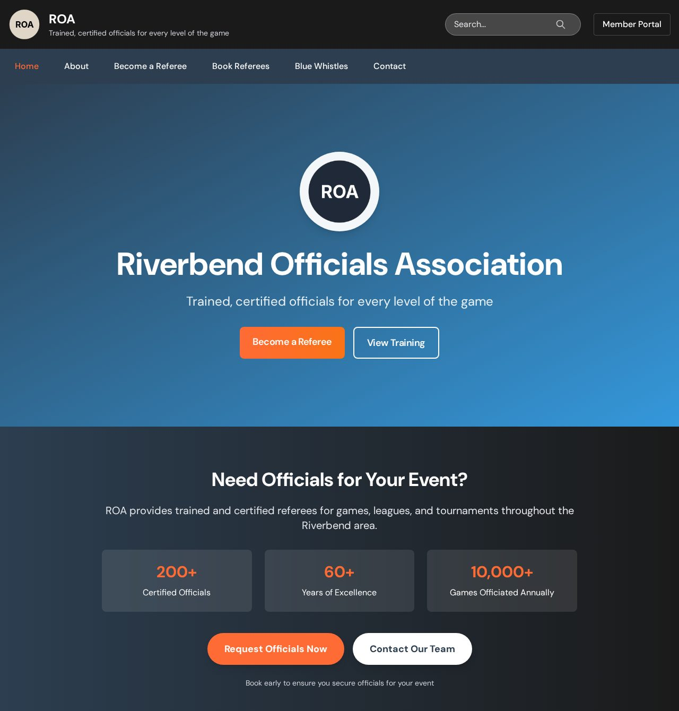 | 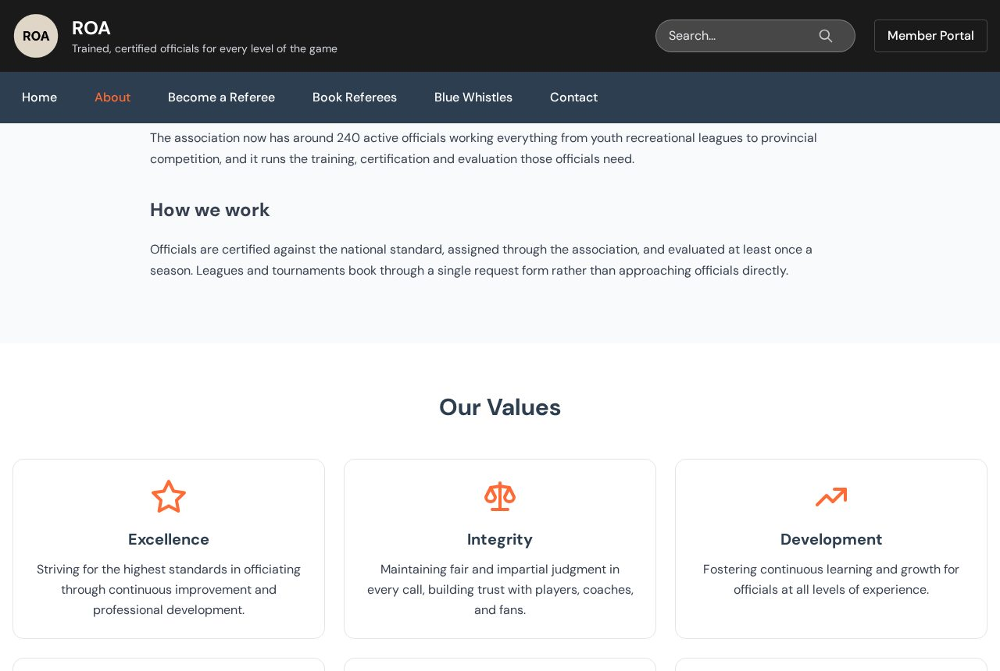 |
| Home: hero, tagline and the booking call to action. | About: the section the portal CMS writes, above the values grid. |
| 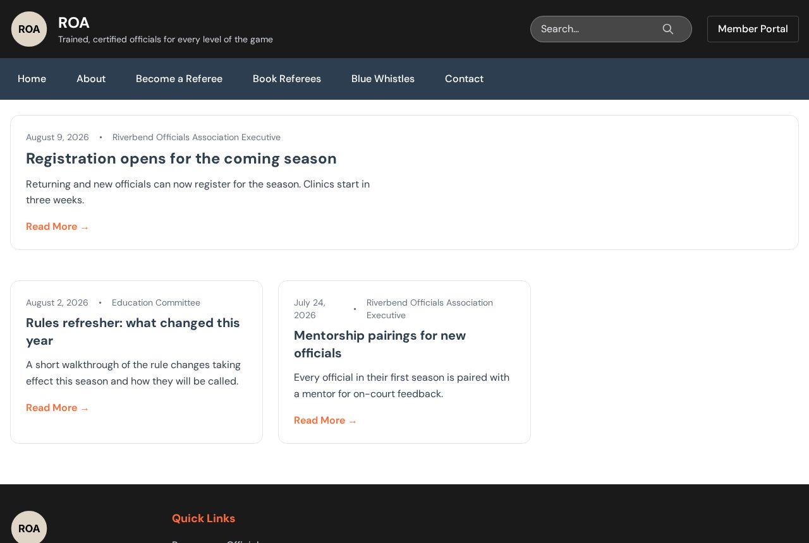 | 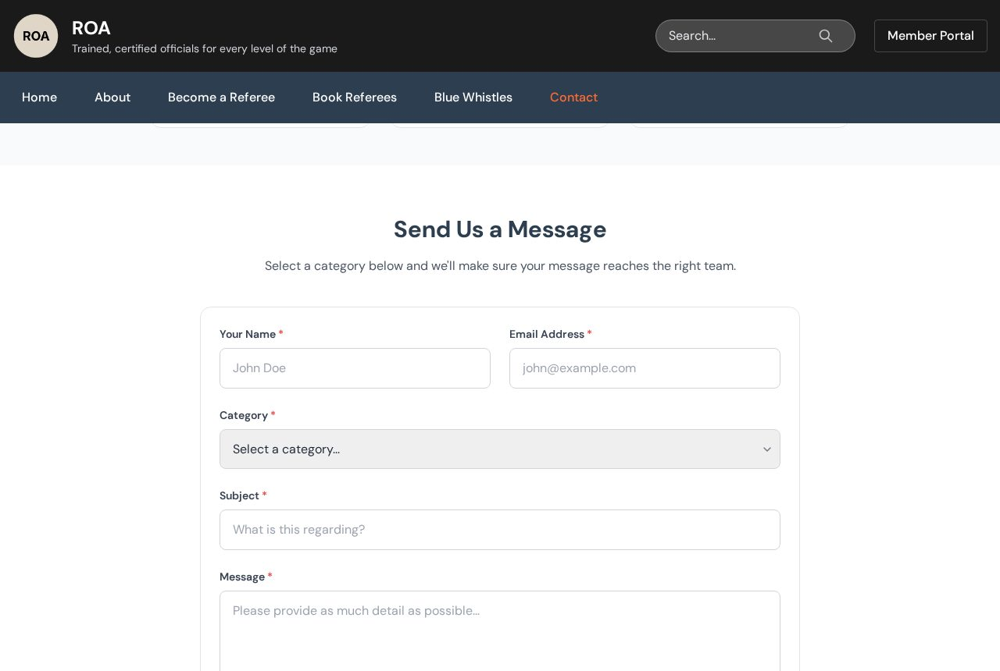 |
| News, built from the markdown in `content/news/`. | The contact form, routed by category to a role mailbox. |

### Members portal

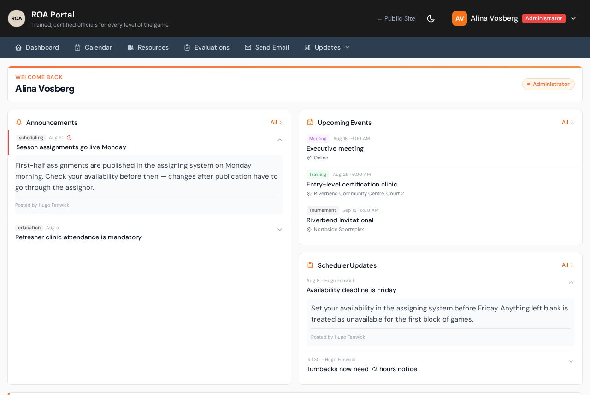

The dashboard: announcements, upcoming events and scheduler updates. Which navigation items
and tiles appear depends on the signed-in member's role.

| | |
|---|---|
| 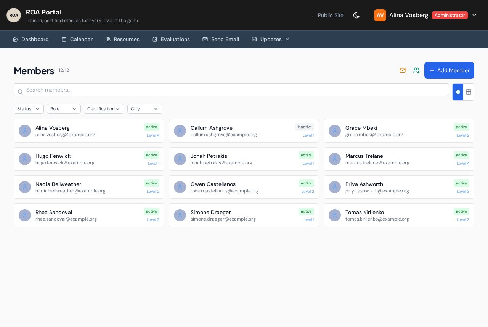 | 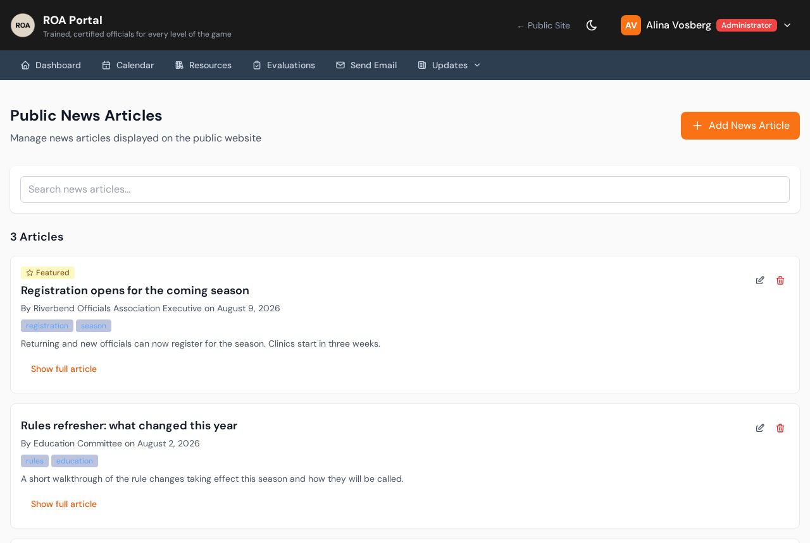 |
| The member directory, filtered by status, role, certification and city. | The public-content admin, which is the CMS. Training, resources, officials, executive team and page copy are edited here and published to the public site. News is drafted here and published as files. |

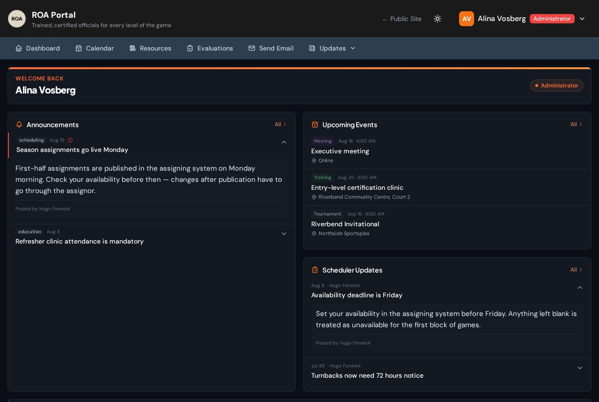

The portal ships a dark surface as a designed choice rather than an inverted stylesheet. It
is per-member and stored in `localStorage` under `portal-theme`.

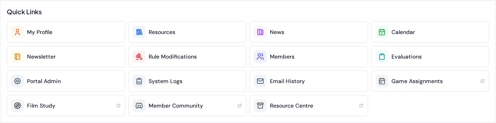

Quick links. The four tiles carrying an external-link icon (game assignments, film study,
member community, resource centre) render only when the matching value in
`lib/siteConfig.ts` is set. Leave one empty and the tile disappears instead of pointing at a
service you do not use.

### On a phone

Most members open this between games, on a phone.

| | |
|---|---|
| 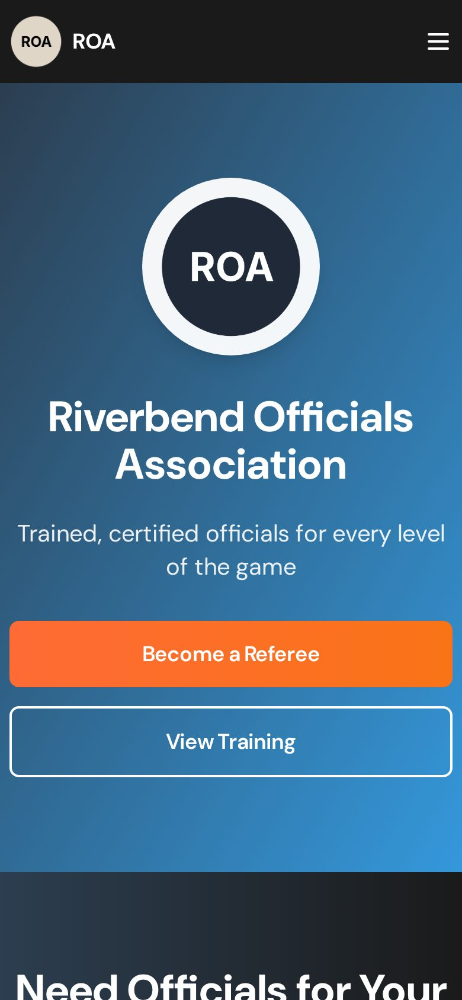 | 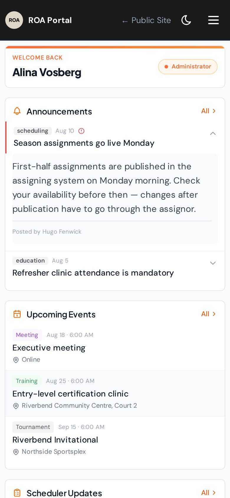 |

---

## What's in it

### Public site

Everything a league or a prospective official sees. All of it is editable from the portal, so publishing does not mean a deploy.

Home, About with the executive team, and News. Training carries the certification pathway and a registration link per event. Resources is a document library with categories and access levels. Two recruitment pages, Become a referee and New officials. A "request officials" form feeds the service-request inbox in the portal, and a contact form routes by category to whichever mailbox you configure. Search covers every published page and article.

### Members portal

Behind the login, dark by default, with its own mobile layout.

The dashboard shows upcoming events, the latest announcement, the newsletter and scheduler updates. The member directory lists the roster with certification level, rank and contact details, filtered and searchable. Members edit their own profile, including emergency contact. There is a calendar of association events, plus the members' view of news and resources, which includes anything marked members-only.

### Admin

Content management covers public pages, training events, resources, the officials list and the executive team, with rich text and image upload. News is drafted in the same place but published from `content/news/`. Member management handles email invites, the accept-invite flow, and role and capability assignment. Two inboxes: service requests from the public form, and contact submissions.

### Optional modules

Eight features are on or off from one config block, and a disabled one is never built rather than hidden:

`evaluations` `statistics` `newsletter` `ruleModifications` `schedulerUpdates` `mail` `adminLogs` `adminEmailHistory`

A flag is not an access control. See [Optional modules](#optional-modules) for what it does and does not do.

### Underneath

Next.js 15, exported as a static site, with Netlify Functions behind it.

Supabase Postgres with 14 ordered migrations, row-level security on all 25 tables, and storage policies on five buckets. The chain refuses to run against a database that is not empty rather than half-applying to it.

Email goes through Resend, SMTP or Microsoft Graph, chosen by one environment variable. An unconfigured provider throws instead of silently dropping mail.

Roles are three structural rungs, member, executive and admin, plus capabilities that cut across them: evaluator, scheduler, instructor, assignor.

Rich text is Jodit, MIT licensed and self-hosted, so there is no editor account to create and no key to obtain.

386 tests, a type check, a lint job, a build that runs with no environment configured at all, and a link checker that fails on any dangling link in the export.

---

## This is a static export

`next.config.ts` sets `output: 'export'` for production builds. `npm run build` writes a
directory of HTML, CSS and JS to `out/`, and that is the whole front end. No Node server
renders pages on request.

Every page is prerendered at build time. No route uses `force-dynamic`, and adding one
breaks the build rather than degrading quietly. Pages ship with an empty state and fetch
from Supabase or from `/api/*` once they are in the browser, so first paint has no data in
it.

The backend is Netlify Functions. `netlify/functions/` holds 36 handlers, all running with
the Supabase service-role key, which makes them the place authorisation actually happens.
`netlify.toml` rewrites `/api/*` onto them.

The constraint that catches people out: a broken import or a wrong asset path ships as a
blank page or a silent 404, not a build failure. Look at the pages after a change. A green
build is not evidence. Dev mode renders dynamically, so something can work locally and still
be missing from the export.

`node scripts/check-exported-links.mjs` catches part of that after a build: it reads every
local `href` out of `out/` and fails on any that resolves to nothing. It is also why
switching a portal module off has to happen at build time rather than at request time, which
[Optional modules](#optional-modules) goes into.

`node scripts/check-news-render.mjs` is the news-specific companion. It fails if an article
file has no exported page, if the list links to anything other than those articles, or if a
body arrived as literal `##` characters instead of rendered markdown.

---

## Prerequisites

Node 18 or newer. `netlify.toml` pins `NODE_VERSION = "18"` for the deploy build, and the
no-env CI job runs on 22.

A Supabase project, free tier is enough to start. You need the project URL, the anon key and
the service-role key.

A Netlify account. The redirects, the functions and the build config are all Netlify
specific.

An email provider, because password resets, invitations and the contact form all send mail.
Pick one of Resend, SMTP or Microsoft Graph.

Docker and the Supabase CLI (already a devDependency) are optional. You only need them to
run a local database or to regenerate the screenshots.

---

## Supabase setup

### Migrations

`supabase/migrations/` holds sixteen files that build the whole schema: members, roles and
their RLS policies, portal content, evaluations, public content, invite tokens, email
history, logging, submissions, season stats, the storage buckets with their policies, and the
rule that keeps an evaluation's row and its file saying the same thing.

```bash
npx supabase link --project-ref <your-project-ref>
npx supabase db push
```

**The chain targets an empty database and refuses to run against anything else.** That is
not a convention written in a comment. The first migration opens with a preflight block that
raises before it has created, altered or dropped anything, if `public` already holds tables
the chain creates and the baseline stamp is absent. Because it is the first file, nothing
else has run either, so the database is left exactly as it was. There is no partially applied
state to unpick.

Applying the chain twice to the same database is a no-op rather than an error. What it will
not do is upgrade a database that got its schema somewhere else. If the guard fires, create
a fresh database, run the chain there, and move the data across. Do not hand-patch the old
one to get past the check.

To try it locally first:

```bash
npx supabase start
npx supabase db reset   # applies all fourteen against an empty database
```

### Storage buckets

The last migration in the chain creates five buckets and the policies that guard them. You do
not need to create anything in the dashboard.

| Bucket | Public | Reads | Writes |
|---|---|---|---|
| `email-images` | yes | anyone holding the object URL | admin, executive |
| `portal-resources` | no | any signed-in member | any signed-in member, but only the uploader or an admin or executive can change or remove an item |
| `newsletters` | no | any signed-in member | admin, executive |
| `training-materials` | no | any signed-in member | admin, executive |
| `evaluations` | no | whoever can read the evaluation row that points at the file (the official it is about, admins, executives, and anyone holding the evaluator capability), plus whoever uploaded it | any signed-in member |

`email-images` is public because those images are embedded in outgoing mail and the person
reading that mail in Gmail has no Supabase session. Public means anyone holding an object URL
can fetch the bytes. It does not mean the bucket can be browsed: listing goes through the same
policies as everything else, and no anonymous caller has a read policy anywhere in the file.
The other four are private, and for them RLS is the whole access model.

Every privilege check calls `public.is_admin_or_executive()`, the same helper the table
policies use, so storage and rows cannot drift apart when the role model changes. The
reasoning behind each bucket is written out at the top of
`supabase/migrations/20260810001400_storage_policies.sql`. Read that before you change one.

The `evaluations` bucket needs a second question answered. A member may read the file when
they may read the evaluation row that points at it, and that is a rule about the row rather
than about the object. Object keys say nothing about who a report is about, but the reference
runs the other way: `evaluations.file_url` holds `storage://evaluations/<key>`, so a policy on
`storage.objects` can start from `name` and find the row. Both policies then sit on one
predicate, `public.can_read_evaluation()` in
`supabase/migrations/20260810001600_evaluation_object_access.sql`. Change who may read a report
and the file follows, with nobody having to remember the bucket. An object with no row behind
it stays owner-only, which is the state of every upload in the moment before its row exists.

The migration is also what decides whether a bucket is public. Flip `portal-resources` to
public in the dashboard and the next `db push` flips it back. Change the migration instead.

`netlify/functions/upload-file.ts` holds the service-role key and bypasses all of this, so the
role check inside that function is still the only thing guarding the service-role path. The
policies protect the browser upload path in `lib/fileUpload.ts`, and they are what is left
underneath if someone makes a bucket public.

How those files are served is the next section.

### Downloads

A private bucket has no URL that works without a session, so nothing in the portal stores
one. `resources.file_url`, `newsletters.file_url` and `evaluations.file_url` hold a reference
to the object instead:

```
storage://portal-resources/1730000000000-rulebook.pdf
```

`lib/fileUpload.ts` writes that reference after an upload. `lib/fileDownload.ts` turns it back
into a link when something needs one: `resolveFileUrl()` calls `createSignedUrl()` with the
reader's own JWT, so the SELECT policy that governs a download also decides whether a link
can be minted at all. A member who cannot read the object cannot get a URL for it either,
which is the point. There is no second access model here to keep in step with the policies.

Links last five minutes. Every button that points at an uploaded file goes through
`<FileDownloadLink>`, which mints inside the click, so a download or an open-in-a-tab hands
the browser a URL that is seconds old however long the page has been sitting there, and a list
of forty resources costs no storage requests until somebody wants one of them. A download link
also asks storage for `Content-Disposition: attachment`, since the `download` attribute on an
`<a>` is ignored cross-origin and is not enough on its own. When a mint is refused, the button
says so instead of doing nothing. The one plain anchor left is in the public content editor
under `/portal/admin/public-content/resources`, where `file_url` is a URL an admin types into a
form rather than anything this application uploaded.

Within those five minutes `resolveFileUrl()` remembers what it minted and gives the same
string back to anything that asks again, so a viewer re-rendering three times costs one round
trip rather than three. It stops reusing a link thirty seconds before the token dies, so a
download never starts against a URL that expires mid-transfer.

That memo is keyed to whoever minted the link, and it has to be. A signed URL is a bearer
token, `logout()` signs out without reloading the page, and the module holding the memo lives
on into the next session. On a shared machine, a cache keyed on the file alone would hand the
second member a working link minted for the first. The key carries the acting session instead,
and signing out empties the memo as well.

Embeds are the case that has to be handled rather than asserted. A viewer signs once when it
opens. That is fine for an `` or a PDF, which have finished fetching long before the
token dies, and not fine for `<video>` or `<audio>`, which go on issuing range requests as
playback and seeking continue and would otherwise stop mid-clip at the five minute mark. Those
elements re-mint on their own error and put the member back where they were. Nothing else in
the portal holds a minted URL in an attribute waiting to be clicked.

`email-images` is the exception and stays on `getPublicUrl()`. Those images are embedded in
outgoing mail, the recipient opens that mail in Gmail with no Supabase session, and a signed
link there would expire into a broken image in every message the association has ever sent.

A row holding an older `/storage/v1/object/public/<bucket>/...` or `/object/sign/...` string
still resolves: the bucket and path are read back out of it and signed like any other
reference, so an adopter with data already in place has nothing to migrate. Public URLs for
`email-images` pass through untouched, and so does anything that is not a storage location at
all, since `resources.file_url` also holds pasted external links for link and video
resources.

### Row-level security

The migrations enable RLS on every table and grant `anon`, `authenticated` and
`service_role` explicitly, so nothing relies on Supabase's legacy auto-exposure of new
tables. The shape is:

`members`. You can read your own row. Admins and executives can read everyone's. Nobody
writes this table from the browser: `authenticated` is granted SELECT and nothing else, so
every roster write goes through a function holding the service-role key. A trigger is the
second barrier, stopping an unprivileged session from setting or changing its own `role`,
`capabilities` or `user_id` on the day someone re-grants UPDATE.

`evaluations`. You can read the evaluations written about you, attachment included. Admins,
executives and anyone
holding the `evaluator` capability can read all of them. Admins, executives and evaluators can
write one; only admins and executives can edit or delete. `netlify/functions/evaluations.ts`
applies the same rule before a request reaches the database, and adds one thing a policy
cannot express: an evaluator may edit an evaluation they authored, which needs the author
joined back to the caller.

Public content (`public_news`, `public_training_events`, `public_resources`,
`public_pages`). Anyone can read the active rows, anonymous visitors included, because the
public site reads them straight from the browser. Admins and executives write.

Everything else is service-role only and reachable through the functions.

`public.structural_role(uid)` is the only function in the schema that reads `members.role`.
`public.is_admin(uid)` and `public.is_admin_or_executive(uid)` are thin wrappers over it, and
`public.has_capability(uid, cap)` answers the capability half. Those four are where the
policies ask who is calling.

### The role model

Two questions, deliberately kept in two columns.

**Structural role** is where someone sits: `member` < `executive` < `admin`. Ordered, one per
person.

**Capabilities** are what someone does: `evaluator`, `scheduler`, `instructor`, `assignor`,
`mentor`. Unordered, any number at once, independent of the ladder. A member can be an
evaluator. So can an executive.

Collapsing the two is what kept `evaluator` out of the database for so long. One ordered field
cannot say "a member, but also an evaluator" without inventing a rung for every combination,
and every new rung multiplies through every policy in the schema. Split apart, the policy is
one line: `has_capability(auth.uid(), 'evaluator')`.

`lib/roles.ts` is the definition. The UI, the Netlify Functions and the tests import from it,
and `__tests__/unit/config/roles.test.ts` reads
`supabase/migrations/20260810001500_role_model.sql` off disk and fails when the file and the
schema stop agreeing. That test is doing the real work here. The bug was never a missing
check; it was one idea written down in three places that could drift apart.

Two things you can change without writing SQL. Labels come from `NEXT_PUBLIC_ROLE_LABEL_*` and
`NEXT_PUBLIC_CAPABILITY_LABEL_*`, and nothing in SQL reads them, so calling your executives
"the board" is one line in `.env`. The capability list itself lives in `lib/roles.ts`: the
database constrains the shape of `members.capabilities` (lowercase identifiers, no duplicates)
and never its contents, and `has_capability()` compares whatever string it is handed, so
adding or renaming one needs no migration.

There is one exception, worth knowing before you rename anything. `evaluator` is written into
an RLS policy by hand, because a policy has to name the capability it is testing. Rename that
slug and the migration needs the new name too. The config test fails and says so rather than
letting the policy quietly stop matching.

The structural ladder is enumerated by a CHECK constraint, so renaming one of those three is a
migration. They are the org chart, so that should be rare.

`official` was the old name for `member`. It is still accepted on the way in, so a roster row
carrying `role = 'official'` resolves to a member, but it is no longer a value the database
will store.

### Where a role comes from

A person's rung and their grants live in `members.role` and `members.capabilities`, and in no
other place.

Both enforcement layers read those two columns. The RLS policies reach them through
`structural_role()` and `has_capability()`. The Netlify Functions reach them through
`getPrincipal()` in `netlify/functions/_shared/handler.ts`, which looks up the caller's roster
row by `auth.uid()`. The browser reads them through the same `principalFromMemberRow()` helper
in `lib/roles.ts`, so the tiles the portal renders and the requests the API answers are working
from one row. There is a single copy, so there is nothing to keep in step.

Neither column can be written from a browser session. `authenticated` holds no UPDATE grant on
`members` at all, and a trigger refuses any change to `role`, `capabilities` or `user_id` from
an unprivileged session, in case somebody re-grants UPDATE later to support profile editing.
The auth user's `app_metadata` and `user_metadata` are not consulted for authorisation.
`user_metadata` least of all: it holds whatever the account last sent to `PUT /auth/v1/user`,
an ordinary authenticated call that any signed-in user can make about themselves.

One write path does reach those columns, and neither of those barriers covers it.
`netlify/functions/members.ts` is how every roster write in this app happens, it carries the
service-role key, and both RLS and the trigger stand aside for that key. So it enforces the
rule itself. A non-admin caller writes their own profile fields and nothing else. The list of
those fields is `SELF_SERVICE_COLUMNS` in that file, written as an allow-list rather than as a
list of things to strip, so a column added to `members` next year is refused until somebody
adds it deliberately. `user_id` sits on the privileged side of that line with `role` and
`capabilities`, because it is the column that says which person a rung belongs to.

A signed-in account with no roster row has no rung and no grants. That state is a normal part
of the flow rather than a fault. It is what someone accepting an invitation or signing up on
their own looks like before they register, and `MemberGuard` renders the registration form for
exactly that case. It resolves to nobody rather than to the bottom rung, so nothing that asks
for a rung or a grant will answer it. The SQL side says the same: `structural_role()` returns
NULL for a caller with no row.

Having no rung is not the same as having no access. Announcements, resources, the calendar,
newsletters, scheduler updates, member activities, rule modifications and the stats endpoints
all gate their GET at `'authenticated'`, and `isAuthorized` reads that as "any signed-in
caller", rung or not. A signed-in account with no roster row reads all of it. What stays shut is
whatever asks for a rung or a grant: the roster, the logs, contact submissions, email history,
service requests, and anyone else's evaluations. That line, and not the roster row, is what the
self-service signup decision turns on. See [Auth configuration](#auth-configuration).

### Linking an account to a roster row

A roster row can exist before the person has an account. An admin adds someone with
`skipInvite`, or a season's roster arrives as a bulk import. The row sits there with `user_id`
empty until something points it at an auth user.

Three things do that, and all three are the association acting. The invite flow links the row
when the invitation is redeemed. `sync-members-auth` links rows by address in a sweep an admin
runs. An admin editing a member sets it directly.

The fourth is the registration screen, and it is the one with a rule attached. When someone
signs in and finds an unclaimed row at their address, `MemberRegistration` claims that row
instead of creating a second one, but only if the row sits at the default rung and carries no
grants. Anything above that has to be linked by one of the other three.

The cap is there because an address is only evidence when Supabase is checking it. Email
confirmations are off in a fresh project, and while they are off, signing up as
`treasurer@your-association.org` takes nothing but typing it. An unlinked executive row waiting
at that address would then be one PUT away from belonging to whoever got there first. A claim
capped at the floor can only hand over what registering a fresh row would have handed over
anyway.

The cap protects the rung. It does not protect what else is in the row, which for a member is a
phone number, a home address and an emergency contact. Turn on **Confirm email** under
Authentication, Providers, Email before you let a matching address identify anybody.

`__tests__/integration/principal-escalation.test.ts` runs the claim against a live stack from a
real signup, and fails if a privileged row ever answers one again.

The cost is one indexed two-column lookup per authenticated request. `createHandler` resolves
it once, before the auth gate, and hands the answer to the handler. Nothing is cached between
requests, deliberately. A warm Lambda container lives for minutes or hours, and a cached rung
would keep a demoted admin privileged for that whole time.

This is worth spelling out because it used to work the other way, and that version was a hole
an adopter could walk into. `getPrincipal()` read `app_metadata.role` and fell back to
`user_metadata.role`. Every self-signup and every invited user before an admin stamped a role
on them had no `app_metadata.role`, so the fallback decided, and the fallback is a field the
account writes for itself:

```
signup  ->  PUT /auth/v1/user {"data": {"role": "admin"}}  ->  refresh the token
```

Three ordinary calls, and the account read the entire member roster, every evaluation, every
contact submission and the system logs. The capability half went the same way: `evaluator` in
place of `admin` bought every evaluation in the association. Row-level security was never the
problem. The policies keyed on `members.role` and they held. The functions carry the
service-role key, so RLS never applies to them, and their own check was the only thing standing
there.

Dropping the `user_metadata` fallback would have closed that and left `app_metadata` as the
source of truth: a second copy of the roster for somebody to keep in step by hand, forever,
with an escalation waiting on the day they forgot. Reading the roster instead means the two
layers agree because they are looking at the same thing.

`__tests__/integration/principal-escalation.test.ts` runs the sequence above against a live
stack and fails if it ever works again. `__tests__/unit/security/principalResolution.test.ts`
pins the resolver to the roster without needing a database.

### Auth configuration

Supabase Auth with email and password. In the dashboard:

Set **Site URL** to your production origin.

Add `<your origin>/auth/callback` to **Redirect URLs**. `getAuthCallbackUrl()` in
`lib/siteConfig.ts` builds that path and takes no arguments on purpose. Threading user input
into it turns the login flow into an open redirect through Supabase's allow-listed domain.

Turn on **Confirm email**, under Authentication, Providers, Email. It is off in a fresh local
project, and while it is off an address proves nothing, because anyone can sign up as anyone.
The portal treats a matching address as grounds for handing someone the unclaimed roster row
waiting at it, which is how an invited member registers themselves, and that row holds their
phone number, home address and emergency contact. See [Linking an account to a roster
row](#linking-an-account-to-a-roster-row).

Turn self-service signup off unless you have a reason to want it on. A stranger who signs up no
longer becomes an administrator, but they do get a working account, and a working account reads
most of the portal: announcements, resources, the calendar, newsletters, scheduler updates,
member activities, rule modifications and the stats all answer any signed-in caller. Only the
roster, the logs, contact submissions and other people's evaluations ask for a rung.

They do not stay off the roster, either. `AuthProvider` mounts on the login page as well as the
portal, and `syncUserToMembers` in `contexts/AuthContext.tsx` POSTs a `members` row on the
`SIGNED_IN` event, so a self-signup is on the roster at the bottom rung from their first sign-in,
with no admin involved. That is deliberate, and it is how an invited person registers
themselves, but it means "no admin has touched this account" and "this account has no rung" stop
describing the same thing after one sign-in. Nobody climbs higher that way. The `members`
function hands a non-admin caller the default rung, refuses capability grants in every shape
they can arrive in, and refuses any column that is not that caller's own profile. The guard
trigger in migration 0015 says the same at the database.

Leave signup on only if you are content for anyone who finds the site to read your members-only
content.

Roles are not stored on the auth user. See [Where a role comes from](#where-a-role-comes-from).

---

## Environment variables

Copy `.env.example` to `.env.local` and fill it in. That file is the reference: every
variable this project reads is listed there with a comment saying what it does and what
happens if you leave it out. Duplicating it here would only let the two drift apart.

Two things worth repeating. Anything prefixed `NEXT_PUBLIC_` is compiled into the browser
bundle, so never put a secret behind that prefix. And on identity and branding values the
prefix is mandatory, not a house style: `lib/siteConfig.ts` explains why, but the short
version is that an unprefixed read resolves to `undefined` in the browser, so your server
render would carry the organisation's name while the client fell back to the placeholder.

Nothing is required to compile. `npm run build` succeeds with the environment completely
empty, and `.github/workflows/build-no-env.yml` checks that on every push, so a fork builds
before its owner has an account anywhere. What comes out is a site that talks to no database.
For a deploy people can actually use, the floor is `NEXT_PUBLIC_SUPABASE_URL` and
`NEXT_PUBLIC_SUPABASE_ANON_KEY`; everything else falls back to a neutral placeholder.

---

## Local development

```bash
npm install
npx netlify dev
```

That gives you the site and the functions on one origin, with `/api/*` routed the way it is
in a deploy. Nearly every page needs it: the portal, resources, training and the contact
form all go through `/api`. `/news` does not, because it is built from files.

**It does not give you your data.** `netlify.toml` sets `[dev] command = "npm run dev"`, so
Netlify Dev starts the same `next dev` server and proxies it. `NODE_ENV` is `development` on
both paths, and `lib/api/client.ts` line 14 says:

```js
export const USE_MOCK_DATA =
  process.env.NEXT_PUBLIC_USE_MOCK_DATA === 'true' || process.env.NODE_ENV === 'development'
```

The member directory therefore renders fixtures out of `lib/mockData/` under `netlify dev`
exactly as it does under `npm run dev`, and setting `NEXT_PUBLIC_USE_MOCK_DATA=false` will not
turn that off, because the second clause is true on its own. You can point a fresh Supabase
project at this, open the member directory, watch it fill with people, and have learned
nothing about whether your wiring works. Those people are the fixtures.

To exercise the real thing, serve the production export:

```bash
npm run build
npx netlify dev --dir out --offline
```

`next build` runs under `NODE_ENV=production`, the fallback goes quiet, and every `/api` call
lands on a function talking to your database. That is the arrangement
`scripts/screenshots/regenerate.sh` uses, which is why the screenshots above show seeded rows
and not `lib/mockData/`. The cost is a rebuild per change: the export is static, so nothing
hot-reloads.

`npm run dev` on its own is the third option. Pages render on port 3000, `/api` is not there
at all, and the fixtures are still what you see. It is for styling.

To work against a local database instead of your Supabase project:

```bash
npx supabase start
npx supabase db reset
npx supabase status          # copy the API URL and keys into .env.local
```

Other scripts:

| Command | Does |
|---|---|
| `npm test` | Unit tests. 386 across 24 suites, no external services. |
| `npm run test:integration` | Integration tests against a real Supabase project. Needs `NEXT_PUBLIC_SUPABASE_URL` and `SUPABASE_SERVICE_ROLE_KEY`. Creates and cleans up tagged rows and a couple of throwaway auth users. |
| `node scripts/check-exported-links.mjs` | Run after a build. Reads every local `href` out of `out/` and fails on any that resolves to nothing. |
| `npm run build` | The production static export, into `out/`. |
| `npx tsc --noEmit` | Type check. |
| `npm run lint` | ESLint, via `eslint.config.mjs` (`next/core-web-vitals`). Also runs as part of `npm run build`, since `next.config.ts` sets `eslint.ignoreDuringBuilds: false`. |

---

## Rebranding

`lib/siteConfig.ts` is the seam. Organisation name, short name, tagline, location, founding
year, member count, logo, colours, social links, external service links, mail domain and
portal feature labels all live there, and every one of them reads an optional
`NEXT_PUBLIC_*` variable before falling back to a placeholder.

So there are two ways to rebrand: edit the file, or set the variables. Setting the variables
keeps your diff against upstream empty, which matters if you ever want to pull changes down.

The shipped defaults are deliberately unfilled: "Your Officials Association", `example.org`,
empty social links. They are meant to look wrong on the rendered page so that anything you
missed is obvious. `example.org` is reserved by RFC 2606 and cannot belong to a real
organisation, so an unconfigured deploy cannot leak mail to a stranger.

### Colours

Set the five `NEXT_PUBLIC_BRAND_COLOR_*` variables. `tailwind.config.ts` imports
`BRAND_COLORS` and registers each as a `brand-*` utility, so `bg-brand-primary` follows
whatever you set. Tailwind generates its CSS at build time, so a colour change needs a
rebuild.

The portal's dark surfaces (`portal-bg`, `portal-surface`, `portal-border`, `portal-hover`,
`portal-accent`) are separate literals in `tailwind.config.ts`. They were picked as a set and
they are not a tint of your brand colour, so change them together or leave them alone.

### Assets

| Path | Used for |
|---|---|
| `public/images/logos/org-logo.png` | Header, footer, home-page hero, portal and auth screens. Override with `NEXT_PUBLIC_ORG_LOGO_URL`. Replace this one first: the placeholder has the initials "ROA" painted into the pixels, and no variable reaches them, so until you swap the file your own short name and the badge beside it disagree on every page. |
| `public/images/icons/` | Favicons, apple-touch icon, Android icons, web manifest. Paths are listed in `FAVICONS` in `lib/siteConfig.ts`. |
| `public/documents/` | Placeholder PDFs and spreadsheets: fee schedule, invoice policy, services agreement, scheduling templates. Replace with your own. |
| `content/` | Markdown seeded into the public site at build time. News articles, page copy, portal announcements, rule modifications, resource descriptions. |

Everything shipped in those directories is a neutral placeholder. None of it is anyone's
real document.

### What `lib/siteConfig.ts` does not reach

Some page copy is hardcoded, and no config change will touch it.

`components/ui/ElevateCTA.tsx` renders "200+ certified officials", "60+ years of excellence"
and "10,000+ games officiated annually" as literals on the home page.

`ORG_SPORT` defaults to `basketball` rather than to a placeholder, and deliberately so: page
copy under `app/` still names basketball certification levels and rulebooks in places no
config value reaches. Changing the variable is step one of a sport rebrand, not the whole
job.

The Blue Whistle Program pages (`app/new-officials/`, plus sections of
`app/become-a-referee/` and `app/about/`) describe a specific new-official initiative. Keep
it, rename it, or delete the route. The name is also a literal in the main navigation, at
`components/layout/Header.tsx` lines 110 and 153, so "Blue Whistles" sits on every public
page whether or not you keep the route behind it.

Grep for your old organisation's name after a rebrand. It is the only reliable check.

---

## Optional modules

Not every association wants the whole portal. Eight parts of it are switchable, in `MODULES`
in `lib/siteConfig.ts` or through the matching `NEXT_PUBLIC_MODULE_*` variables. Everything
ships on, so you can see what is there before deciding what to cut.

| Module | Route | What it is | What it needs | Why you might turn it off |
|---|---|---|---|---|
| `evaluations` | `/portal/evaluations` | Evaluators file reports on officials; executives read them and track who has been assessed. | The evaluations tables, plus members carrying the evaluator role. | Your association assesses people in person and nobody wants to retype it into a form. |
| `statistics` | `/portal/statistics` | Per-official game counts for a season, loaded from an Arbiter xlsx export. | The season-stats tables, and exports in the exact shape `lib/stats/arbiterGameInfo.ts` parses. | You do not use Arbiter. Note that nothing links to this route even when it is on, so it is the least missed of the eight. |
| `newsletter` | `/portal/newsletter` | A PDF archive with an in-page viewer, and the latest-issue widget on the dashboard. | Somewhere to upload the PDFs, and somebody willing to write them. | You do not publish one. |
| `ruleModifications` | `/portal/rule-modifications` | League-specific variations on the rulebook, written as markdown in `content/portal/rule-modifications/`. | Nothing beyond the content files. | Every league you serve plays the standard rules. |
| `schedulerUpdates` | `/portal/scheduler-updates` | Short notices from whoever assigns games, and the matching dashboard widget. | Nothing. | Your scheduler already reaches people by email, or through the assigning system's own announcements. |
| `mail` | `/portal/mail` | Compose and send to members, filtered by role. Admin and executive only. | A configured email provider (`EMAIL_PROVIDER` and its keys). | You send association mail from a list somewhere else. This is the first one to drop if you have not set up a provider. |
| `adminLogs` | `/portal/admin/logs` | Reader for the application log and audit trail. | The `logs` table and the `logs` function. | You would rather read them in the Supabase dashboard, where you can write a real query. |
| `adminEmailHistory` | `/portal/admin/email-history` | Every message the portal has sent, with delivery status. | The email-history table and its function. | Same reason, or you do not want a copy of the send history in the portal at all. |

### What "off" actually does

It stops the route being built. This is a static export, so there is no server standing by to
answer a request with a 404: a route is either sitting in `out/` as HTML or it does not
exist. Each optional route's page file is called `page.module-<key>.tsx` rather than
`page.tsx`, and `next.config.ts` only tells Next.js to treat that filename as a route when
the flag is on. Off, the file is never compiled, no chunk is emitted, and there is no
directory under `out/`. Netlify serves your 404 page to anyone who has the URL.

The navigation reads the same flags. `isRouteEnabled()` takes an href rather than a module
name, so the portal header, the dashboard tiles and the admin index all put the question to
one source instead of each keeping a list of their own. Two lists that have to agree is the
bug this design exists to avoid: a hidden link with a live route behind it is merely
confusing, but a live link with no route behind it is a 404 that a member finds for you.

Three things it does not do:

It is not access control. The Netlify Function and the Supabase table behind a disabled
module are untouched, and anyone who can authenticate can still reach the function directly.
Authorisation lives in `netlify/functions/` and in RLS, and that is where it stays. If you
need a capability gone rather than absent from the site, delete the function and revoke the
grants.

It is not a runtime switch. The flags are read once, while you build. Changing one means a
rebuild and a redeploy, and a browser holding the previous bundle keeps the previous
navigation until it reloads.

It does not delete anything. Rows stay in Supabase. Switch the module back on, rebuild, and
everything is where you left it.

One cosmetic oddity: the build summary reports a gated route's size as `0 B`. Next.js sizes
routes by looking for a file called `page`, and these are not called that. The chunk is built
and loaded like any other.

### Adding or removing one

To gate a route that is not on the list, add a key to `ModuleKey`, a flag to `MODULES` and an
entry to `PORTAL_MODULES` in `lib/siteConfig.ts`, then rename the route's `page.tsx` to
`page.module-<kebab-key>.tsx`. `__tests__/unit/config/modules.test.ts` fails if those four
drift apart, and the two `__tests__/unit/portal/moduleNav*.test.tsx` files fail if the
navigation stops asking.

To remove a route outright, delete its directory and every link to it, then rebuild and run
the link check:

```bash
npm run build && node scripts/check-exported-links.mjs
```

It pulls every `href` out of every exported page and asks the filesystem whether the target
resolves. It only sees prerendered markup, though, so it cannot check the portal navigation
at all: everything behind `AuthGuard` prerenders as a loading spinner. The two `moduleNav`
test files are what cover that half.

---

## Who gets into the portal

`app/portal/layout.tsx` wraps every portal page in one chain, and the order is load-bearing:

```
ThemeProvider → AuthProvider → AuthGuard → RoleProvider → MemberProvider → ToastProvider → MemberGuard
```

Two gates, asking different questions. `AuthGuard` asks whether somebody is logged in and
sends everyone else to the login page. `MemberGuard` asks whether that logged-in user has a
member record, and when they do not it renders the registration form inline instead of
redirecting.

The inline render is deliberate. Someone accepting an invitation and someone signing up on
their own both land on a portal route holding an account with no member row behind it, and
both get the same form in the same place. Redirecting would mean a separate registration
route, a way of remembering where they were going, and two flows to keep working instead of
one.

Leave the ordering alone. `RoleProvider` and `MemberProvider` both read the session that
`AuthProvider` establishes and `AuthGuard` has already vouched for, so moving either above
the guard gives you a provider reading a session that may not exist.

---

## Deploy

### Netlify

Connect the repository. There is almost nothing to fill in, because `netlify.toml` is
committed and **on Netlify the file overrides the dashboard**, not the other way round.
Whatever the toml sets is the value that runs, whatever the UI shows you: build command,
publish directory, functions directory, Node version, the `/api/*` rewrite, the security
headers.

| Setting | Value | Where it comes from |
|---|---|---|
| Build command | `npm install && npm run test:integration && npm run build` | `netlify.toml` |
| Publish directory | `out` | **you have to edit `netlify.toml`, see below** |
| Functions directory | `netlify/functions` | `netlify.toml` |
| Node version | 18 | `netlify.toml`, `NODE_VERSION` |

#### Fix the publish directory before your first deploy

`netlify.toml` as committed says:

```toml
publish = ".next"

[[plugins]]
  package = "@netlify/plugin-nextjs"
```

That pair configures a server-rendered Next.js site. This one is a static export.
`npm run build` writes the site to `out/`, and `.next/` holds build manifests, not servable
pages. Deploy it untouched and the build goes green while the deploy publishes a directory
with no pages in it.

Typing `out` into the dashboard's Publish directory field will not save you, because the toml
overrides it. Edit the file:

```toml
publish = "out"
```

and delete the `[[plugins]]` block, since the Next.js plugin has no server to adapt. It is a
defect in the template and it is the first thing to change after you fork.

The committed build command runs the integration tests, so a failing test fails the deploy,
and the build environment needs `SUPABASE_SERVICE_ROLE_KEY`. That gate is deliberate. Drop
`npm run test:integration` from the command if you would sooner not run tests against a live
project on every deploy.

### Environment variables in Netlify

Set everything your deploy needs under Site configuration, then Environment variables. At
minimum:

- `NEXT_PUBLIC_SUPABASE_URL`, `NEXT_PUBLIC_SUPABASE_ANON_KEY`, `SUPABASE_SERVICE_ROLE_KEY`
- `NEXT_PUBLIC_SITE_URL`, your production origin. There is no fallback. Netlify's own `URL`
  and `DEPLOY_PRIME_URL` are unprefixed, so they reach the build and the functions but never
  the browser bundle. To use Netlify's value, promote it in the build command:
  `NEXT_PUBLIC_SITE_URL="${NEXT_PUBLIC_SITE_URL:-$URL}" npm run build`
- `EMAIL_PROVIDER` and its credentials
- `NEXT_PUBLIC_EMAIL_DOMAIN`, plus any `EMAIL_*` role mailbox you want to override

`NEXT_PUBLIC_*` variables are baked in at build time. Changing one needs a redeploy, not a
restart.

### Scheduled functions

`netlify/functions/scheduled-log-cleanup.ts` trims the log tables. Netlify scheduled
functions have to be configured in the dashboard; it will not run on its own.

---

## Known gaps

These are real and unfixed. An adopter finding them out later is the outcome this section
exists to prevent.

### Downloads from the private buckets need signed URLs

`resources.access_level` restricts who sees a resource in the list. It does not restrict the
object. Keys in `portal-resources` are a bare `<timestamp>-<name>` with nothing tying them to
a resource id, so the storage policy cannot honour the column, and any signed-in member
holding an object key can mint a link for it. Anything that has to be narrower than
members-only wants a Netlify function that reads the row, checks the level, and signs the URL
itself.

### `npm audit` still has four production findings

`npm audit --omit=dev` used to report 42 vulnerabilities in production dependencies, 40 of
them high. Most of that came from two packages nothing in the app actually imports:
`decap-cms-app` (the CMS admin bundle, dead code since Decap CMS was pulled from this fork)
and `pdfjs-dist` / `react-pdf` (`PDFViewer.tsx` renders PDFs with a plain
`<object>`/`<iframe>`, not a PDF.js canvas; react-pdf was never wired up, and a 1.1MB
`public/pdf.worker.min.js` was shipping in every build without a single request for it).
Dropping both, then running `npm audit fix` for what it could resolve without a major bump,
took the count from 42 down to 10: 2 low, 8 high. Moving `@netlify/functions` from 4 to 5
cleared six of those, leaving 4 high.

That bump was smaller than it looked. Version 4 shipped 13 direct dependencies and 311
transitive ones, which is where `@netlify/blobs`, `@netlify/dev-utils` (and so `image-size`)
and `@netlify/zip-it-and-ship-it` (and so `esbuild`) came from. Version 5 moved the
local-development half of the package out into a separate `@netlify/functions-dev` and ships
one dependency, `@netlify/types`, taking the install from 82MB to 84KB. The removed `/dev`
subpath was the only breaking change and nothing here imported it. `Handler`, `HandlerEvent`,
`HandlerContext` and `HandlerResponse` are byte-identical across the two versions, and
`schedule()` is still `(cron, handler) => handler`, so none of the 13 files under
`netlify/functions/` that import from the package needed an edit.

What's left, and why it's staying for now:

- **`next` → `postcss` / `sharp` (high).** The fix is Next 16, and this lane doesn't touch
  Next's major version. Both are build-time tools here: `output: 'export'` plus
  `images: { unoptimized: true }` means Next's sharp-based image server never runs in this
  app, and postcss only ever processes this repo's own Tailwind source, never
  user-supplied CSS. Not reachable from a request.
- **`xlsx` (high, no fix available).** SheetJS stopped publishing patched versions to npm;
  the fix exists only on their own CDN, outside what `npm audit` can resolve.
  `lib/stats/readWorkbook.ts` is the only importer, runs entirely in the browser, and only
  ever parses a file the uploading portal member hands it themselves through
  `StatsUploadModal.tsx`. Worst case is a member attacking their own browser tab, not a
  public attack surface, but it's unresolved, and stays that way until SheetJS (or a
  maintained fork) publishes a real fix to npm.

### Stats ingestion assumes Arbiter xlsx exports

`lib/stats/arbiterGameInfo.ts` parses the Arbiter "Game Info" export by column header:
`GameID`, `SiteName`, `LevelName`, `HomeTeams`, `Officials` and the rest. Feed it another
assigning system's export and it will not find a header row at all.

That is deliberate. Half-abstracting it into a generic importer would have produced a
mapping layer nobody could configure and a parser that handled no real file correctly. If
you use a different assignor, replace that one module. It is pure, has no I/O, and is fully
unit-tested.

---

## Documented assumptions

Smaller things that are true about this codebase and will surprise you otherwise.

**News is files, not a table.** `/news` and every `/news/<slug>` page are built from
`content/news/*.md`. The list reads the same directory `generateStaticParams` walks, so a
card on the list always has a page behind it. That agreement is load-bearing: when the list
was fetched from the `public_news` table in the browser instead, an article written in the
portal CMS showed up in the list and 404ed when anyone clicked it. The table and its CMS
screen are still here, relabelled "News Drafts", because nothing on the public side reads
them. Publishing an article means committing a markdown file and deploying. To make the CMS
publish for real, the shape that works on a static export is generating those files from the
table during the build and rebuilding on publish. `node scripts/check-news-render.mjs` fails
if the list and the pages disagree.

**Article bodies are markdown, rendered at build.** `app/news/[slug]/page.tsx` runs the body
through `markdownToHtml()` and then `sanitizeHtml()` before any of it reaches the page. Raw
HTML in a content file is dropped rather than rendered, because `remark-html` runs with
`allowDangerousHtml` off, so a `<script>` pasted into an article produces nothing at all.
Sanitising happens on render and never on write. The suites under `__tests__/unit/security`
are there to keep it that way.

**`npm start` serves the export rather than running Next.** `output: 'export'` leaves no
server to start, and `next start` refuses to run against an exported build. The script calls
`npx serve out` instead, which is what Next's own error message tells you to do. It serves
whatever `npm run build` last wrote, so build first or you are reading stale output.

**Mail addresses are derived, and derivable.** Setting `NEXT_PUBLIC_EMAIL_DOMAIN` moves all
eleven role mailboxes at once, and each one is `<role>@<your domain>`. The domain is public
by construction. Treat the naming scheme as guessable and override individually any role
whose real inbox you would rather not have derived.

**Feature gating works by presence.** A portal tile or an embedded form renders when its
value in `lib/siteConfig.ts` is non-empty and vanishes when it is not. There is no flag
registry and no per-member entitlement.

**Roles are two lists, not one.** The structural ladder (`member`, `executive`, `admin`) is
enumerated in the schema. Capabilities (`evaluator`, `scheduler`, `instructor`, `assignor`,
`mentor`) are a config list the database does not enumerate. Both are defined in
`lib/roles.ts`. See [The role model](#the-role-model).

---

## Licence and attribution

Licensed under the **PolyForm Noncommercial License 1.0.0**, which is source-available and
not OSI-approved open source. You may use, modify and run it for any noncommercial purpose,
which covers a volunteer-run officials association operating its own site. You may not use
it in a commercial product or service. Read [`LICENSE`](LICENSE) before you build anything
on it.

Attribution to **Joey Fisher, Synced Sport / Synced Tech** is required. Redistribution, in
whole or in part, has to carry [`NOTICE`](NOTICE) and a copy of the licence, unmodified.
